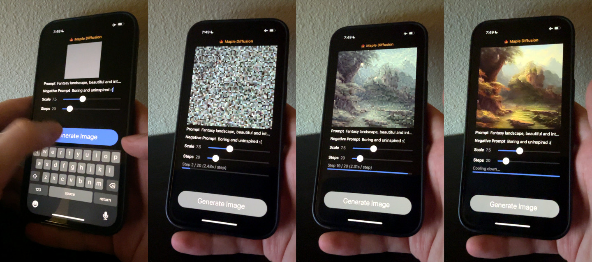
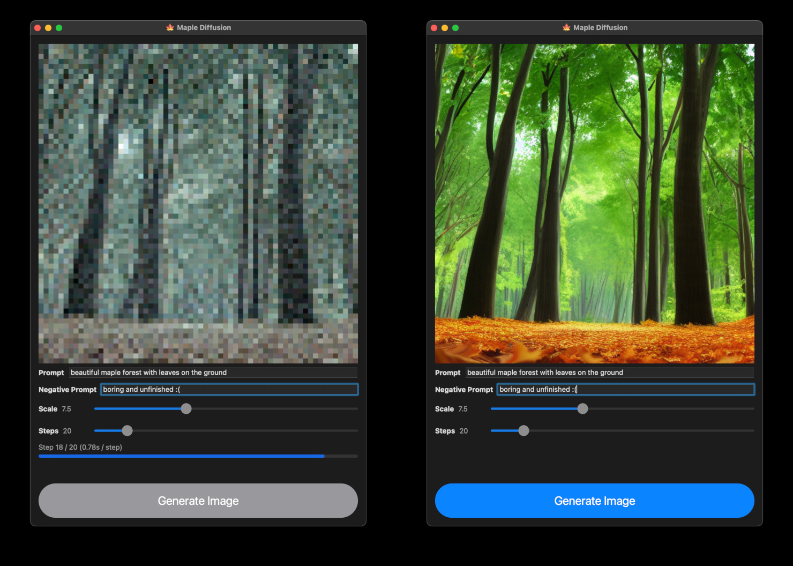

# 🍁 Maple Diffusion

Maple Diffusion runs Stable Diffusion models **locally** on macOS / iOS devices, in Swift, using the MPSGraph framework (not Python).



Maple Diffusion should be capable of generating a reasonable image [in a minute or two](https://twitter.com/madebyollin/status/1579213789823893504) on a recent iPhone (I get around ~2.3s / step on an iPhone 13 Pro).

To attain usable performance without tripping over iOS's 4GB memory limit, Maple Diffusion relies internally on FP16 (NHWC) tensors, operator fusion from MPSGraph, and a truly pitiable degree of swapping models to device storage.

On macOS, Maple Diffusion uses slightly more memory (~6GB), to reach <1s / step.



# Projects using Maple Diffusion

* https://github.com/mortenjust/maple-diffusion/ is a fork with several improvements

# Device Requirements

Maple Diffusion should run on any Apple Silicon Mac (M1, M2, etc.). Intel macs seem to not support Float16 or something.

Maple Diffusion should run on any iOS device with [sufficient RAM](https://blakespot.com/ios_device_specifications_grid.html) (≥6144MB RAM definitely works; 4096MB *might* but I wouldn't bet on it; anything lower than that won't work). Recent iPads should work out of the box; recent iPhones should work if you can get the `Increase Memory Limit` capability working (to unlock 4GB of RAM).

iOS 16.1 (beta) is reportedly broken and always generating a gray image :(

# Usage

To build and run Maple Diffusion:

1. Download a Stable Diffusion PyTorch model checkpoint ([`sd-v1-4.ckpt`](https://huggingface.co/CompVis/stable-diffusion-v1-4), or some derivation thereof)

2. Download this repo

   ```bash
   git clone https://github.com/madebyollin/maple-diffusion.git && cd maple-diffusion
   ```

3. Setup & install Python with PyTorch, if you haven't already.

   ```bash
   # may need to install conda first https://github.com/conda-forge/miniforge#homebrew
   conda deactivate
   conda remove -n maple-diffusion --all
   conda create -n maple-diffusion python=3.10
   conda activate maple-diffusion
   pip install torch typing_extensions numpy Pillow requests pytorch_lightning
   ```

4. Convert the PyTorch model checkpoint into a bunch of fp16 binary blobs.

   ```bash
   ./maple-convert.py ~/Downloads/sd-v1-4.ckpt
   ```

5. Open the `maple-diffusion` Xcode project. Select the device you want to run on from the `Product > Destination` menu.

6. [Manually add](https://github.com/madebyollin/maple-diffusion/issues/5#issuecomment-1279111878) the `Increased Memory Limit` capability to the `maple-diffusion` target (this step might not be needed on iPads, but it's definitely needed on iPhones - the default limit is 3GB).

7. Build & run the project on your device with the `Product > Run` menu.
